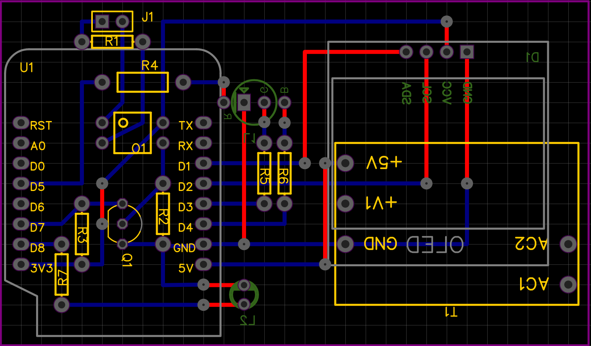

# EspTeleinfo

**(WORK IN PROGRESS!)**

This is a fork of the amazing Wifinfo , part of LibTeleInfo by Charles Hallard. This ESP8266 project connects to french Enedis Energy counter, using the TeleInfo port, and publish the results to:

- Its own webserver
- An OLED display
- Domoticz, Jeedom or Emoncms

You can see Teleinformation official french datasheet [there][1]

*Since this is really dedicated to French energy measuring system, I will continue in French*

## Description

Cette réalisation est basée sur l'excellent  projet [Wifinfo][2] de [Charles Hallard][3], ainsi que [le fork de Sylvain Remy][4] (qui a rajouté le support de Domoticz).

## Fonctionnalités

- Serveur Web fournissant le suivi en temps réel
- Envoi de la TeleInfo vers Domoticz, Jeedom ou Emoncms
- Affichage sur Afficheur OLED de la conso instantanée, et de la période tarifaire
- Led RGB affichant la période tarifaire en court (Heures Pleine/ Heures Creuses)
- Led affichant les trames recues

## Schema

## PCB (Prototype)

## License

Cette oeuvre est mise à disposition selon les termes de la Licence Creative Commons Attribution - Pas d’Utilisation Commerciale - Partage dans les Mêmes Conditions 4.0 International.

Si vous êtes une entreprise et que vous souhaitez participer car vous utilisez cette librairie dans du hardware (box, automate, ...), vous pouvez toujours m'envoyer un exemplaire de votre fabrication, c'est toujours sympa de voir ce qui est fait avec ce code ;-)

[1]: https://www.enedis.fr/sites/default/files/Enedis-NOI-CPT_02E.pdf
[2]: https://hallard.me/wifiinfo/
[3]: https://hallard.me
[4]: https://github.com/sremy91/LibTeleinfo
